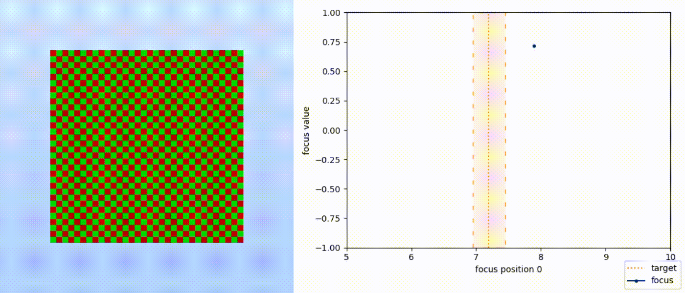

Reinfocus
------------------

`reinfocus` is a python package that makes it easy to create reinforcement learning
environments that use ray tracing to simulate camera focus. See the
[examples](https://github.com/jeffwhunter/reinfocus/examples) for an impression of how it
can be used.

    
     
    <em>
        A ppo trained agent acting in DiscreteSteps-v0. The checkerboard target is
        positioned at some depth, and the agent decides what depth to focus on. It
        receives as input the focus depth, focus value, and the change in both those since
        the last time step.
    </em>

Installation
------------------
To install `reinfocus`, use `pip install reinfocus`.

For GPU support, install
[the lastest NVIDIA graphics drivers](https://www.nvidia.com/Download/index.aspx). Next
you will need to install `cudatoolkit`; how you do that depends on what type of python
installation you use:
 * [anaconda](https://www.anaconda.com/) or
 [variants](https://docs.anaconda.com/free/miniconda/) (recommended): use
 `conda install cudatoolkit`
 * [plain python](https://www.python.org/downloads/release/python-3110/) (untested):
 install [`cudatoolkit`](https://developer.nvidia.com/cuda-downloads), then set
 [`CUDA_HOME`](
    https://numba.readthedocs.io/en/stable/cuda/overview.html#cudatoolkit-lookup)

Only supports Python 3.11 currently.

Special Thanks
------------------
`reinfocus.graphics` is a [`numba`](
https://numba.readthedocs.io/en/stable/cuda/index.html) translation of the wonderful [Ray
Tracing in One Weekend in CUDA](https://github.com/rogerallen/raytracinginoneweekendincuda
) by [Roger Allan](https://github.com/rogerallen).